# OFDM Adaptive Modulation for UAV A2G Links

This repository contains MATLAB simulations for an OFDM-based UAV air-to-ground communication system. The code compares fixed modulation and adaptive modulation under distance-dependent UAV A2G channel conditions.

The results follow Chapter 4 of the final report.

## Code and Report Section Mapping

| Report section | Main purpose | MATLAB file |
|---|---|---|
| 4.2.1 Constellations Comparison | BPSK and 16-QAM constellation comparison | `BPSK_modulation.m`, `Modulation_16QAM.m` |
| 4.2.2 Geometry Analysis | Elevation angle, LoS probability, path loss, and received SNR versus distance | `A2G_modle.m` |
| 4.2.3 Theoretical and Simulated BER Comparison | BPSK BER under AWGN, Rayleigh, and Rician fading | `BPSK_Rician_Rayleigh.m` |
| 4.3 Fixed and Adaptive Modulation Performance | BER, switching thresholds, throughput, Shannon capacity, and BER-distance behaviour | `BER_Throughput_Performance.m` |
| 4.4.1 Effect of UAV Altitude | BPSK BER comparison at different UAV heights | `BPSK_different_altitudes.m` |
| 4.4.2 Effect of Rician K-Factor | BPSK BER comparison with different Rician K values | not uploaded yet |
| 4.4.3 Effect of Propagation Environment | Adaptive modulation across suburban, urban, dense urban, and high-rise urban environments | `different_scenario.m` |

## 4.2.1 Constellations Comparison

The constellation examples show the basic trade-off between robustness and data rate. BPSK has only two constellation points, so it is more tolerant to noise. 16-QAM carries more bits per symbol, but the points are closer together and need a better channel.

`BPSK_modulation.m`

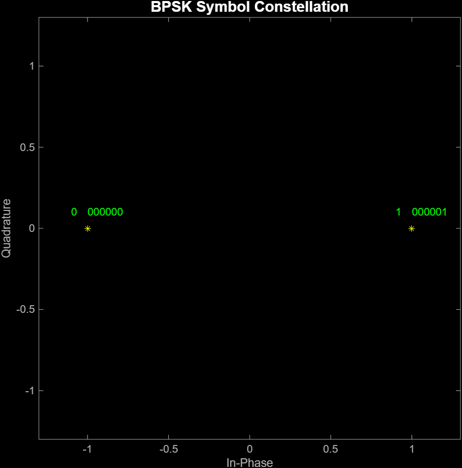

`Modulation_16QAM.m`

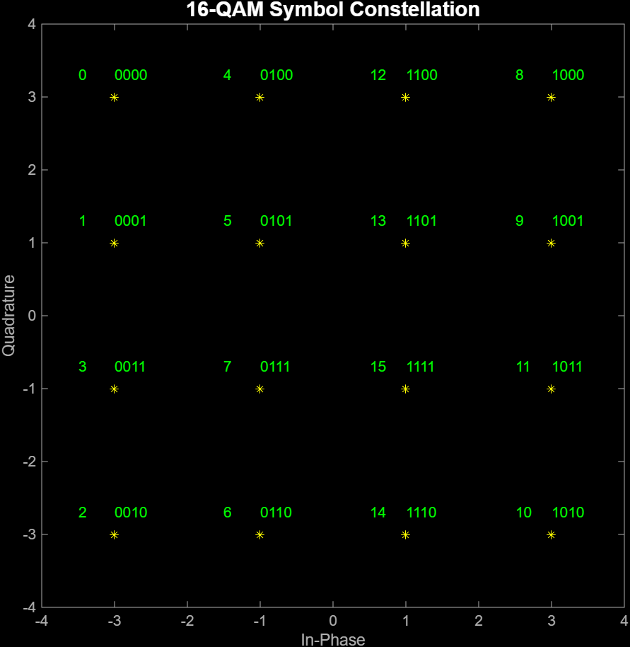

## 4.2.2 Geometry Analysis

`A2G_modle.m` calculates the geometry and link budget for the UAV A2G channel. It plots elevation angle, LoS probability, path loss, and received SNR against horizontal distance.

As distance increases, the elevation angle and LoS probability drop. Path loss increases, and the received SNR becomes worse.

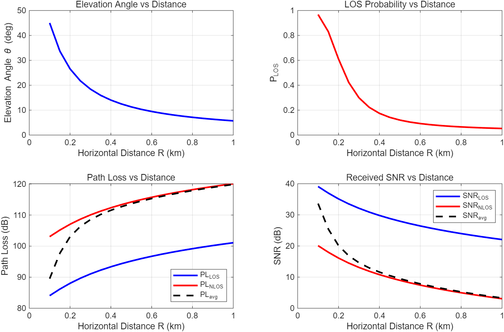

## 4.2.3 Theoretical and Simulated BER Comparison

`BPSK_Rician_Rayleigh.m` compares BPSK BER under AWGN, Rayleigh, and Rician fading. The purpose is to check that the simulation follows the expected theoretical behaviour.

AWGN gives the best BER curve, Rayleigh gives the worst, and Rician sits between them because it includes a stronger direct path.

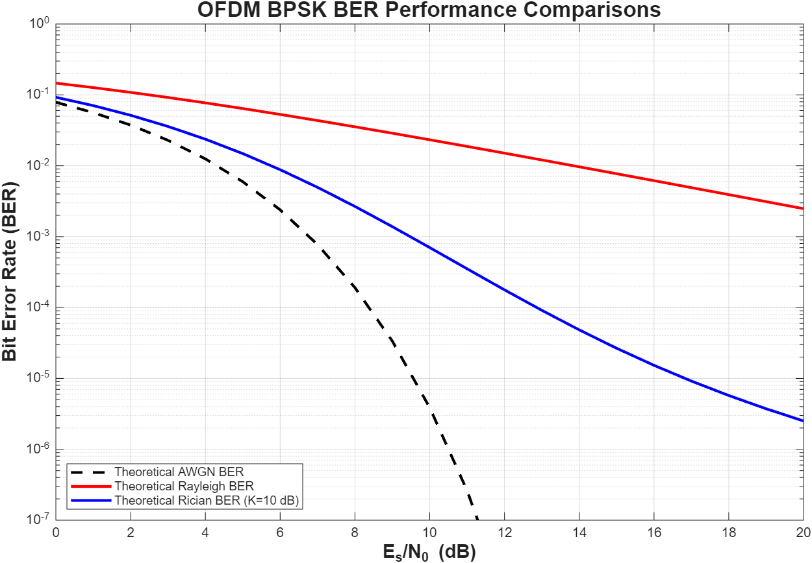

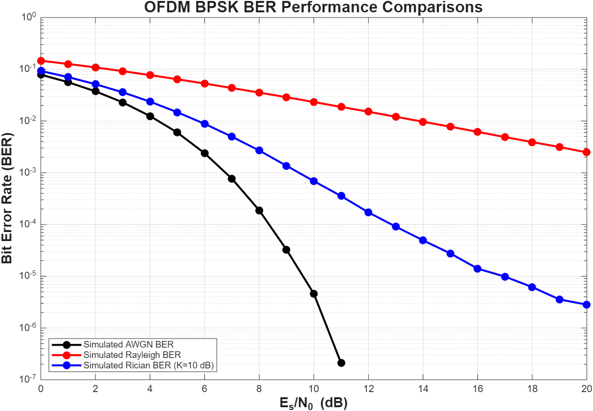

## 4.3 Fixed and Adaptive Modulation Performance

`BER_Throughput_Performance.m` is the main script for the fixed and adaptive modulation comparison.

It first finds the BER switching thresholds in the SNR domain. The adaptive system starts in outage at low SNR, then switches through BPSK, QPSK, 16-QAM, and 64-QAM as SNR improves.

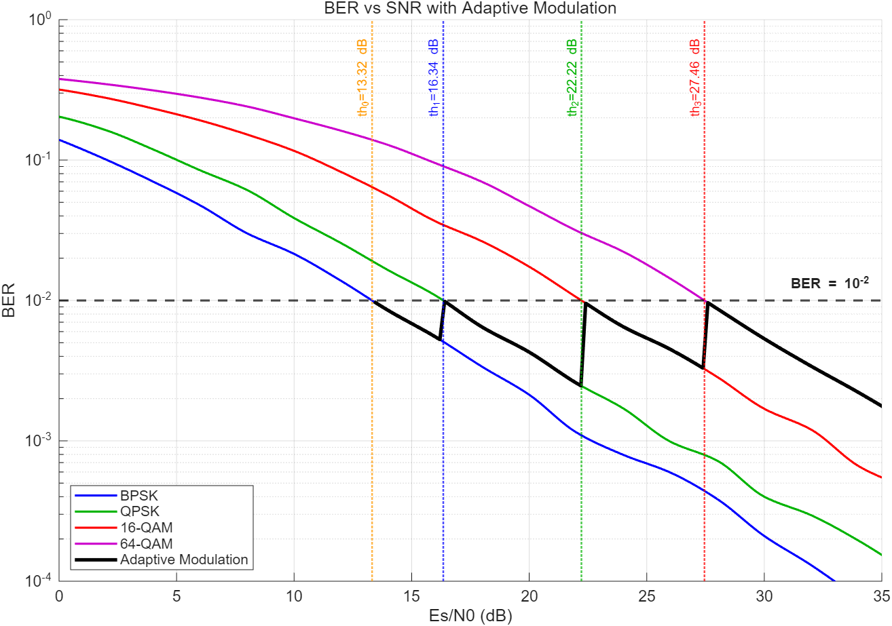

The same script also compares throughput and Shannon capacity. The adaptive modulation curve increases in steps because the system only has four available modulation levels.

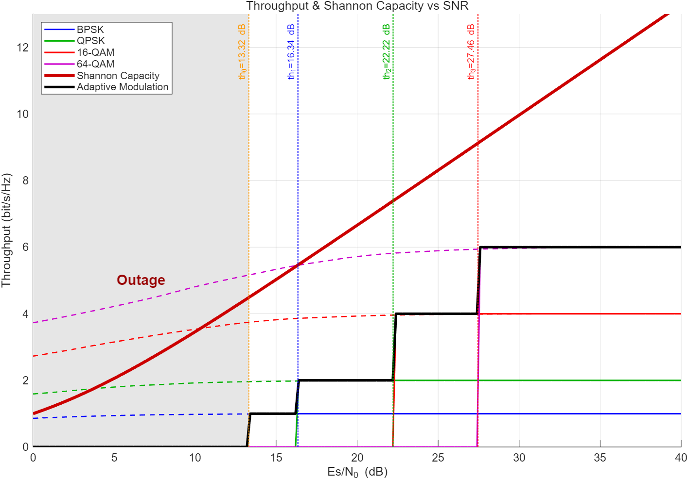

In the distance-domain results, fixed modulation schemes fail at different distances. 64-QAM fails first, while BPSK has the longest reliable range.

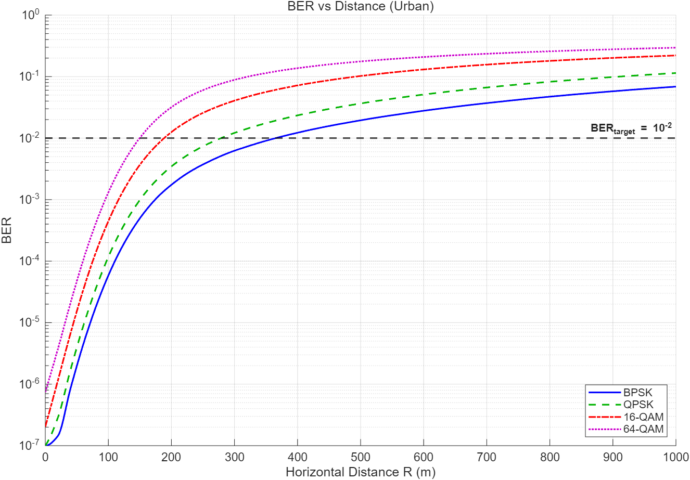

Adaptive modulation follows the higher-order schemes at short distance and then switches down as the channel becomes weaker.

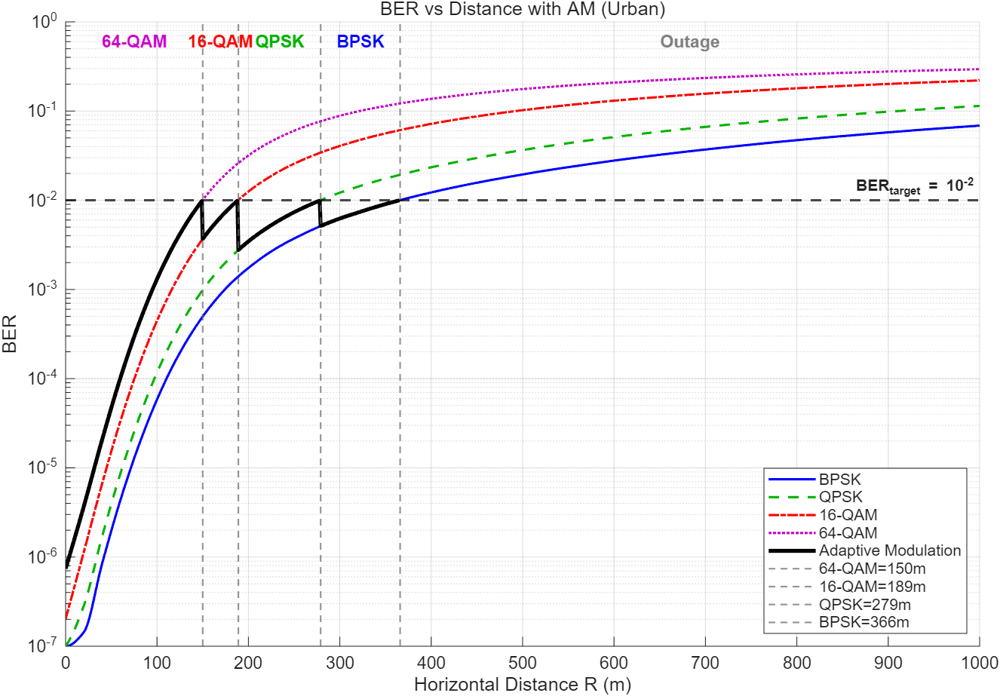

## 4.4.1 Effect of UAV Altitude

`BPSK_different_altitudes.m` compares BPSK BER at different UAV heights.

Increasing altitude can improve the LoS probability, but at short range the longer propagation distance can also add extra path loss. In the report results, the 300 m case gives the best overall performance over most of the distance range.

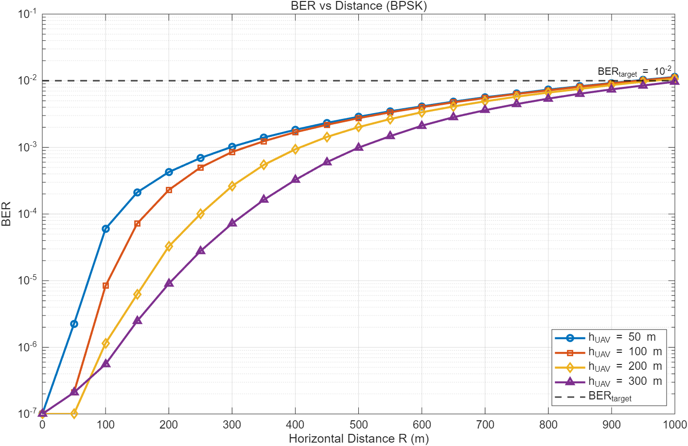

## 4.4.2 Effect of Rician K-Factor

The K-factor comparison shows that the Rician K-factor mainly matters at short distances, where LoS links are more likely. The difference becomes smaller at longer distances because path loss and reduced LoS probability dominate.

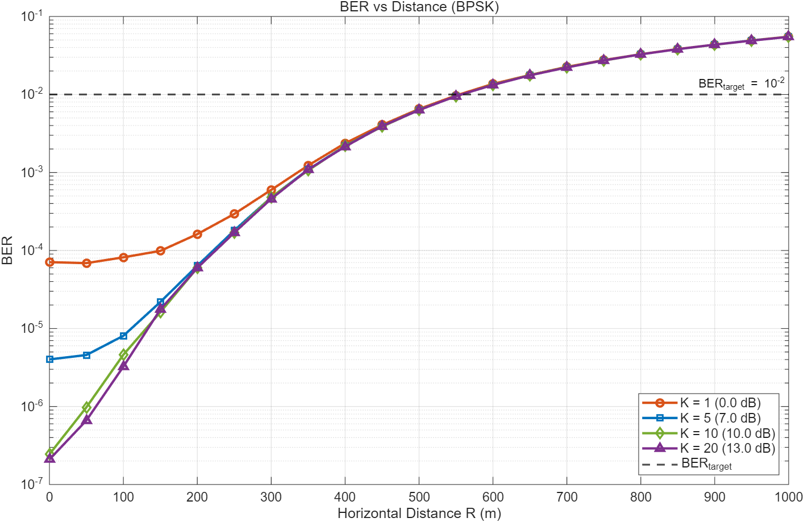

## 4.4.3 Effect of Propagation Environment

`different_scenario.m` compares suburban, urban, dense urban, and high-rise urban environments.

The propagation environment has the strongest impact on the final performance. Suburban conditions allow the link to keep higher-order modulation for longer distances. High-rise urban conditions are much worse, and even BPSK can fail very early.

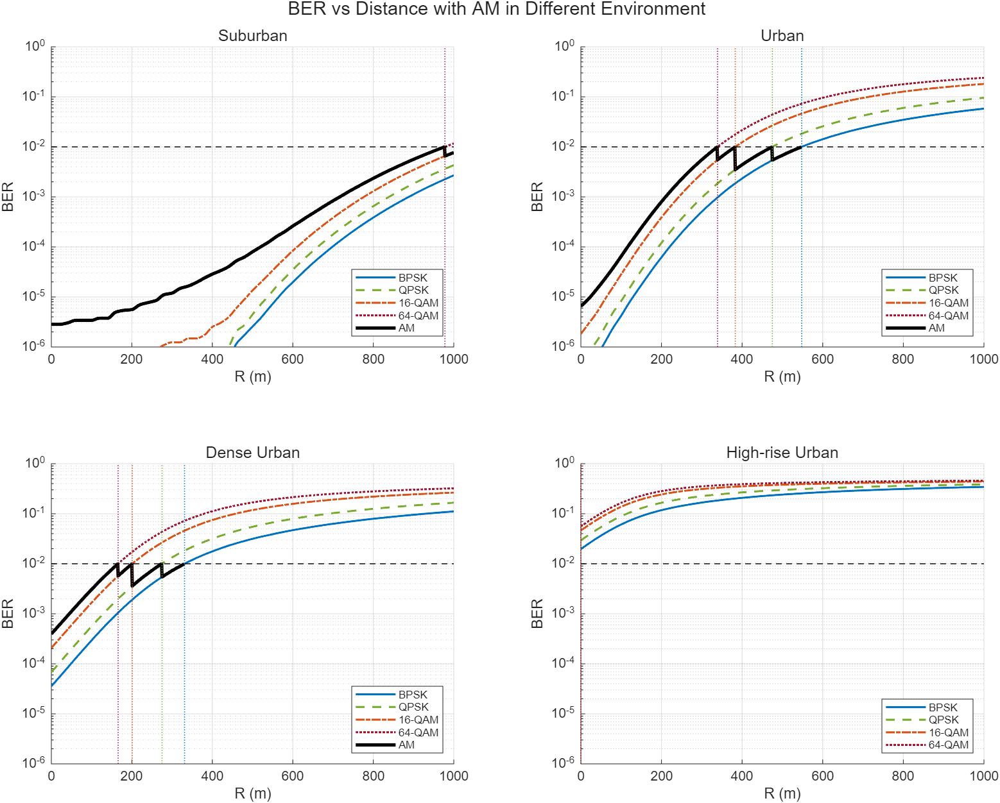

The modulation selection plot shows how the adaptive system changes scheme with distance.

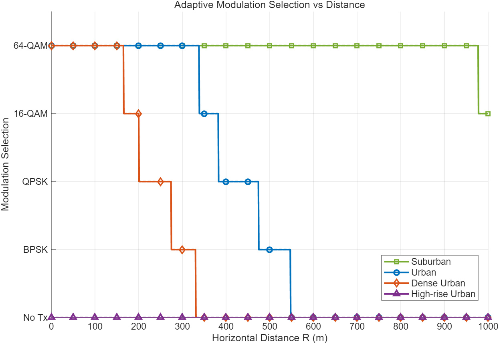

The spectral efficiency plot shows the throughput cost of switching to more robust modulation.

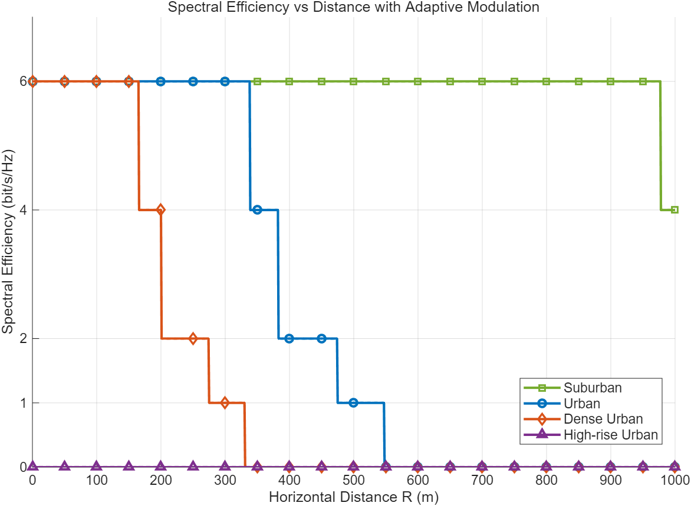

## Notes

The simulations use Monte Carlo methods, so small changes can appear between runs. The adaptive modulation target BER is `10^-2`. Monte Carlo simulation takes a lot of time as the number of trials are really big, to achieve better effeciency, could decrease the number of run trials.
